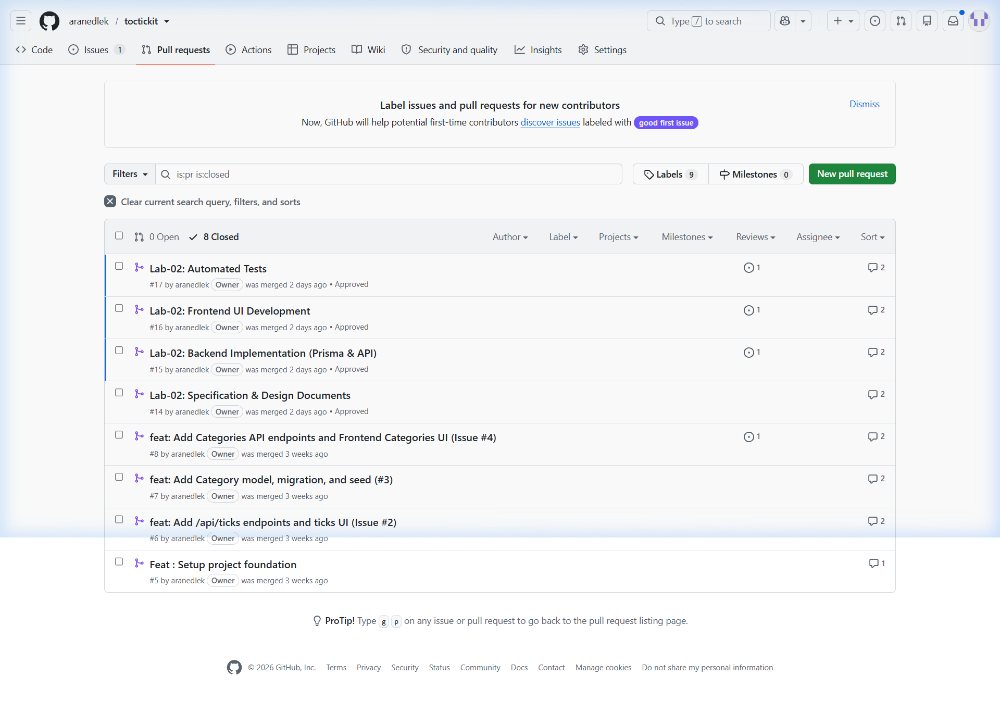
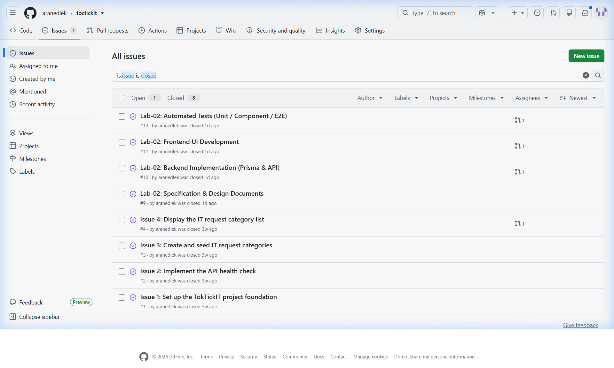

# Lab 02 Report: Software Product Increment
## TokTickIT IT Service Desk

| รายการ | รายละเอียด |
|--------|-----------|
| **ชื่อ-นามสกุล** | Aran Edlek |
| **รหัสนักศึกษา** | 67070505230 |
| **วิชา** | Software Engineering Practice |
| **Lab** | Lab 02 – Requester MVP Sprint |
| **Repository** | https://github.com/aranedlek/toctickit |

---

## 1. Sprint Goal

Deliver a working **Requester MVP** for the TokTickIT ticketing system. By the end of this sprint, a development requester can:
- เลือก identity ผ่านหน้า Requester Selection
- สร้าง Ticket พร้อมแนบไฟล์ได้สูงสุด 5 ไฟล์
- ดู Ticket ของตัวเองพร้อม Search, Filter, และ Pagination
- ดูรายละเอียด Ticket แบบ read-only

---

## 2. Sprint Scope

### In Scope
- Development Requester Selection screen (simulated login ไม่มี real auth)
- Create Ticket screen พร้อม Attachment Upload
- My Tickets screen พร้อม Search, Filter, Sort, Pagination
- Ticket Detail screen (read-only)
- Attachment soft-delete lifecycle
- REST API endpoints ครอบคลุมทุก screen
- PostgreSQL + Prisma schema + seed data
- Responsive layout (Desktop / Tablet / Mobile)

### Out of Scope
- Real authentication / JWT
- Agent / Admin roles
- Email notifications
- Ticket editing หลัง submit
- Comments / Chat

---

## 3. Data Models

### 3.1 Database Schema (Prisma)

**Requester**
```prisma
model Requester {
  id        Int      @id @default(autoincrement())
  name      String
  email     String   @unique
  isActive  Boolean  @default(true)
  createdAt DateTime @default(now())
  tickets   Ticket[]
}
```

**Category**
```prisma
model Category {
  id        Int      @id @default(autoincrement())
  name      String   @unique
  createdAt DateTime @default(now())
  tickets   Ticket[]
}
```

**RelatedSystem**
```prisma
model RelatedSystem {
  id        Int      @id @default(autoincrement())
  name      String   @unique
  createdAt DateTime @default(now())
  tickets   Ticket[]
}
```

**Ticket**
```prisma
model Ticket {
  id              Int            @id @default(autoincrement())
  title           String
  description     String
  status          TicketStatus   @default(OPEN)
  priority        Priority       @default(MEDIUM)
  requesterId     Int
  categoryId      Int
  relatedSystemId Int?
  createdAt       DateTime       @default(now())
  updatedAt       DateTime       @updatedAt
  requester       Requester      @relation(fields: [requesterId], references: [id])
  category        Category       @relation(fields: [categoryId], references: [id])
  relatedSystem   RelatedSystem? @relation(fields: [relatedSystemId], references: [id])
  attachments     Attachment[]
}

enum TicketStatus { OPEN IN_PROGRESS RESOLVED CLOSED }
enum Priority    { LOW MEDIUM HIGH URGENT }
```

**Attachment**
```prisma
model Attachment {
  id          Int       @id @default(autoincrement())
  ticketId    Int
  filename    String
  storagePath String
  mimeType    String
  sizeBytes   Int
  deletedAt   DateTime?   // null = active, non-null = soft-deleted
  uploadedAt  DateTime  @default(now())
  ticket      Ticket    @relation(fields: [ticketId], references: [id])
}
```

### 3.2 Seed Data

**Requesters (Active — 14 คน)**

| # | Name | Email |
|---|------|-------|
| 1 | Aran Edlek | aran@example.com |
| 2 | Anya Suphan | anya@example.com |
| 3 | Ben Rattana | ben@example.com |
| 4 | Chanya Prom | chanya@example.com |
| 5 | Dome Wiriya | dome@example.com |
| 6 | Fah Sai | fah@example.com |
| 7 | Golf Pongsathorn | golf@example.com |
| 8 | Ice Sirichat | ice@example.com |
| 9 | Jay Kittikorn | jay@example.com |
| 10 | Kanya Meechai | kanya@example.com |
| 11 | Luk Nattapon | luk@example.com |
| 12 | Mint Thanawan | mint@example.com |
| 13 | Noon Siriya | noon@example.com |
| 14 | Orm Pakpoom | orm@example.com |

**Categories:** IT Support, HR Request, Finance, Facilities

**Related Systems:** SAP ERP, Microsoft 365, Slack, Google Workspace, Jira, Confluence

---

## 4. Business Rules

| # | Rule |
|---|------|
| BR-01 | Only **active** Requesters (`isActive = true`) appear on Requester Selection screen |
| BR-02 | Ticket ต้องมี **Title**, **Description**, และ **Category** จึงจะ submit ได้ |
| BR-03 | Attachments รองรับเฉพาะ **JPG, PNG, WEBP, PDF** |
| BR-04 | แต่ละไฟล์แนบต้องมีขนาด **≤ 5 MB** |
| BR-05 | Ticket หนึ่งใบมีไฟล์แนบได้สูงสุด **5 ไฟล์** |
| BR-06 | การลบ attachment เป็น **soft-delete** — ตั้งค่า `deletedAt` timestamp |
| BR-07 | Requester ดูได้เฉพาะ **Ticket ของตัวเอง** เท่านั้น |
| BR-08 | Ticket Detail เป็น **read-only** — ไม่สามารถแก้ไขหลัง submit |
| BR-09 | Ticket ใหม่มี status = `OPEN` และ priority = `MEDIUM` โดย default |

---

## 5. REST API Endpoints

| Method | Path | Description | Response |
|--------|------|-------------|----------|
| GET | `/api/requesters` | ดึง requester ที่ active ทั้งหมด | 200 |
| GET | `/api/categories` | ดึง category ทั้งหมด | 200 |
| GET | `/api/related-systems` | ดึง related system ทั้งหมด | 200 |
| GET | `/api/tickets` | ดึง ticket list (filter, search, paginate) | 200 |
| GET | `/api/tickets/:id` | ดึง ticket + attachments | 200 |
| POST | `/api/tickets` | สร้าง ticket ใหม่ | 201 |
| POST | `/api/tickets/:id/attachments` | อัปโหลดไฟล์แนบ | 201 |
| DELETE | `/api/attachments/:id` | Soft-delete ไฟล์แนบ | 200 |

---

## 6. GitHub Workflow Evidence

### 6.1 Pull Requests (Closed)



PR ที่ถูก merge เข้า `lab2-staging`:
- **PR #15** – `feature/lab2-backend` feat(backend): Prisma models, API routes, seed data
- **PR #16** – `feature/lab2-frontend` feat(frontend): Zen Green UI implementation
- **PR #17** – `feature/lab2-tests` test: automated unit and API tests

### 6.2 Issues (Closed)



- **Issue #9** – Database Schema and Seed Data
- **Issue #10** – REST API Implementation
- **Issue #11** – Frontend UI (Requester Selection, My Tickets, Create Ticket, Detail)
- **Issue #12** – Automated Tests (Unit + API)

---

## 7. Test Plan Summary

### 7.1 Unit Tests (Frontend — Vitest)

| Test ID | Description | Status |
|---------|-------------|--------|
| UT-01 | Accept valid JPG (≤ 5MB) | ✅ Pass |
| UT-02 | Accept valid PNG (= 5MB exactly) | ✅ Pass |
| UT-03 | Accept valid WEBP | ✅ Pass |
| UT-04 | Accept valid PDF | ✅ Pass |
| UT-05 | Reject unsupported type (text/plain) | ✅ Pass |
| UT-06 | Reject file > 5 MB | ✅ Pass |
| UT-07 | Reject 6th attachment | ✅ Pass |

### 7.2 API Tests (Backend — Vitest + Supertest)

| Test ID | Endpoint | Scenario | Status |
|---------|----------|----------|--------|
| API-01 | GET /api/requesters | Returns active requesters | ✅ Pass |
| API-05 | POST /api/tickets | Create valid ticket, 201 | ✅ Pass |
| API-06 | POST /api/tickets | Missing title, 400 | ✅ Pass |
| API-07 | POST /api/tickets | Missing description, 400 | ✅ Pass |
| API-08 | POST /api/tickets | Missing categoryId, 400 | ✅ Pass |
| API-09 | POST /api/tickets | Invalid requesterId, 404 | ✅ Pass |

---

## 8. Definition of Done Checklist

| รายการ | สถานะ |
|--------|-------|
| Acceptance Criteria ทุกข้อผ่าน | ✅ Done |
| Automated tests ผ่านทั้งหมด (Unit + API) | ✅ Done |
| Code merge เข้า lab2-staging ผ่าน Pull Request | ✅ Done (PR #15, 16, 17) |
| Merge lab2-staging เข้า main | ✅ Done |
| No lint errors | ✅ Done |
| Responsive design ทดสอบ Desktop / Tablet / Mobile | ✅ Done |
| Seed data รันได้ไม่มี error | ✅ Done |
| docs/lab-02/ai-use.md สมบูรณ์ (10 prompts) | ✅ Done |

---

## 9. AI Use Log

AI (Antigravity / Gemini) ถูกนำมาใช้ช่วยพัฒนาตลอด sprint นี้

| # | Prompt (User Input) | AI Action / Result |
|---|----------------------|---------------------|
| 1 | "ช่วยออกแบบ database schema สำหรับ Lab 02 ให้หน่อย" | AI สร้าง Prisma schema พร้อม model Requester, Category, RelatedSystem, Ticket และ Attachment |
| 2 | "รัน seed ไม่ผ่าน มันฟ้องเรื่อง connection timeout" | AI วิเคราะห์ .env และ prismaClient.ts เปลี่ยน connection จาก HTTP เป็น TCP และติดตั้ง @prisma/adapter-pg |
| 3 | "ช่วยทำหน้า My Tickets เป็นตารางแบบในรูปหน่อย" | AI เขียน MyTickets.tsx ใหม่จาก card layout เป็น responsive table พร้อม pagination |
| 4 | "เขียน unit test สำหรับเช็คขนาดไฟล์แนบหน่อย" | AI แยก logic ออกเป็น validateAttachment.ts และเขียน Vitest test cases 7 กรณี |
| 5 | "ทำ API สำหรับสร้าง Ticket ให้หน่อย" | AI implement POST /api/tickets พร้อม validation ฟิลด์ที่จำเป็น |
| 6 | "รัน backend test ไม่ผ่าน ติด error 500" | AI แก้ Vitest mock ของ Prisma findUnique ให้คืนค่า { isActive: true } |
| 7 | "อัปโหลดไฟล์เกิน 5 ไฟล์ไม่ได้ใช่ไหม เขียนโค้ดดักให้หน่อย" | AI เพิ่ม validation ทั้ง frontend และ backend จำกัดไม่เกิน 5 ไฟล์ |
| 8 | "ช่วยตั้งค่า Theme สีเขียวแบบ Zen Green ให้หน่อย" | AI อัปเดต index.css ด้วย CSS variables ตาม UI spec |
| 9 | "ขอรายชื่อมากกว่า 10 คน และมีชื่อเรา Aran Edlek" | AI แก้ seed.ts เพิ่ม requester เป็น 14 คน โดยมี Aran Edlek เป็นคนแรก |
| 10 | "ช่วยเมิร์จเข้าเมนหลัก Lab 02 ในกิตฮับให้หน่อย" | AI รัน git merge lab2-staging และ git push origin main สำเร็จ 41 files changed |

---

## 10. สรุปงานที่ทำใน Sprint นี้

Sprint นี้สำเร็จตามเป้าหมายทุกประการ:

1. **Backend** — Prisma schema 5 models, migration, seed data 14 requesters, REST API 8 endpoints พร้อม validation
2. **Frontend** — 4 หน้าหลัก (RequesterSelector, MyTickets, CreateTicket, TicketDetail) พร้อม Zen Green theme
3. **Testing** — Unit tests 7 กรณี + API tests 6 กรณี ผ่านทั้งหมด
4. **GitHub Workflow** — 3 feature branches, 3 Pull Requests (PR #15-17), Issues #9-12 ปิดครบ, merge เข้า main เรียบร้อย

---

*Report generated: September 2026*
*Student: Aran Edlek | ID: 67070505230*
