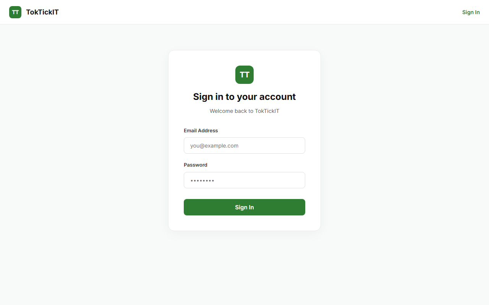
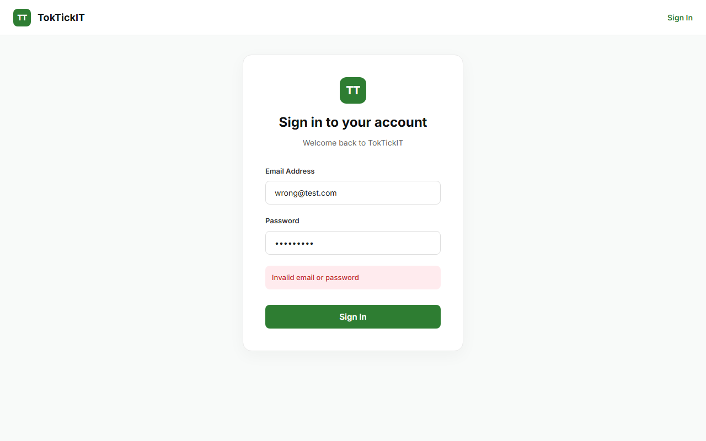
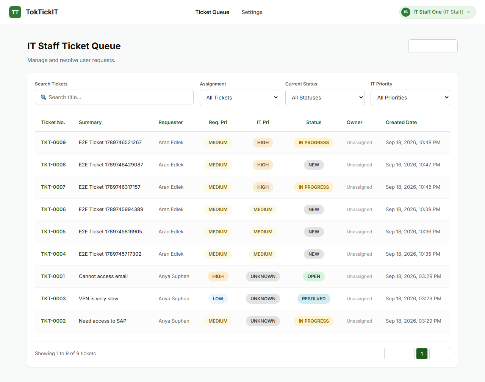
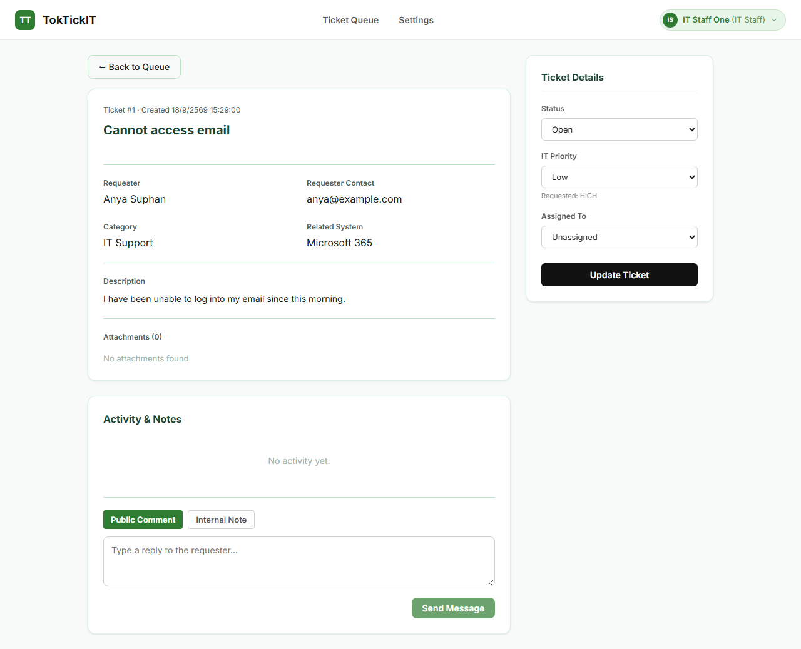
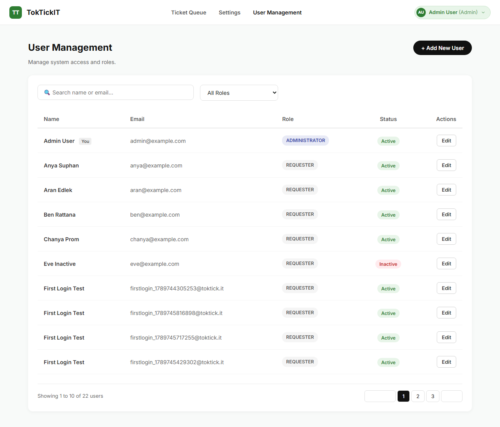
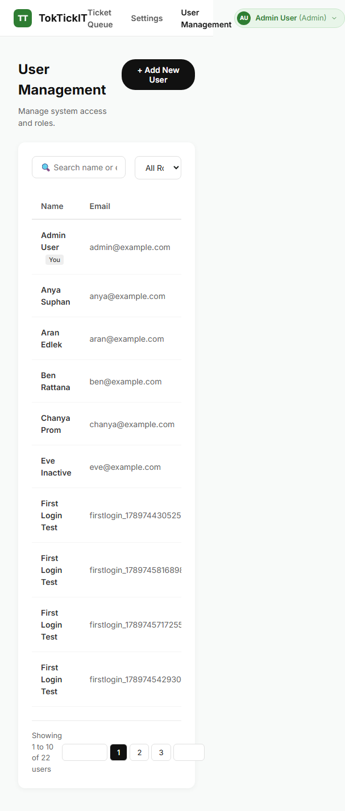
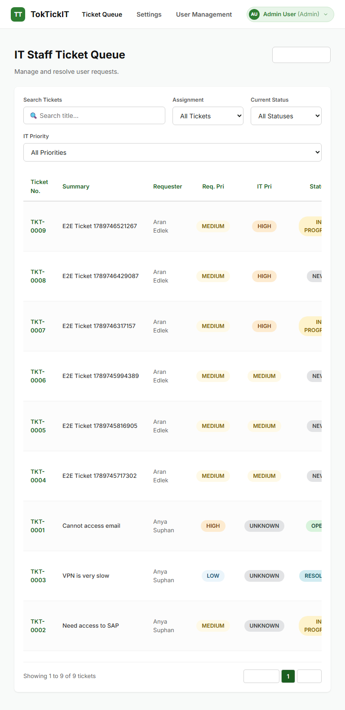
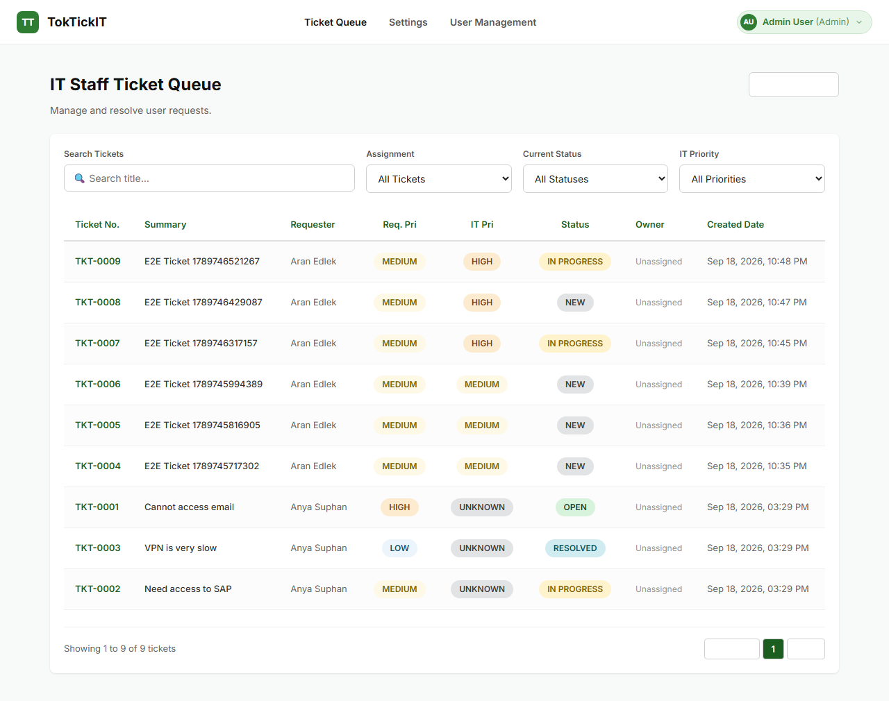

# Lab 03 Report: Authentication, Authorization & Role-Based Operations
## TokTickIT IT Service Desk

| รายการ | รายละเอียด |
|--------|-----------| 
| **ชื่อ-นามสกุล** | Aran Edlek |
| **รหัสนักศึกษา** | 67070505230 |
| **วิชา** | Software Engineering Practice |
| **Lab** | Lab 03 – Authentication & Role-Based Sprint |
| **Repository** | https://github.com/aranedlek/toctickit |

---

## Answer Part 1: Git Use with Engineering Workflow (10 Points)

- **Commit History:** Feature branches (`feature/lab3-issue-1-auth` ถึง `feature/lab3-issue-7-docs`) ได้ถูกสร้างและ merge เข้า `main` เรียบร้อยแล้ว
- **GitHub Issues:** ใช้ GitHub Issues (#19–#24) เป็น Kanban board ครอบคลุมทุก Sprint scope ตั้งแต่ specification, authentication, IT Staff operations, Admin user management, testing, documentation
- **Pull Requests:** ทุก Issue มี PR ที่ผ่าน review และ merge เข้า `main` แล้ว
- **Reviewer:** ดูรายละเอียดผู้รีวิวใน `docs/lab-03/reviewer.md` หรืออ้างอิงจาก GitHub PRs
- **Repository Structure:** โครงสร้างเป็นไปตามที่กำหนด ประกอบด้วย `docs/lab-03/specification.md`, `tests.md`, `ui-spec.md`, `api-spec.md`, `ai-use.md`

---

## Answer Part 2: Spec DD (5 Points)

- **Specification Document:** [docs/lab-03/specification.md](https://github.com/aranedlek/toctickit/blob/main/docs/lab-03/specification.md)
- เอกสารนี้ประกอบไปด้วย:
  - **Functional Requirements:** FR-01 ถึง FR-05 (Authentication, Authorization, IT Staff Operations, Requester Regression, Admin User Management)
  - **Business Rules:** BR-01 ถึง BR-12
  - **Data Changes:** User model, PublicComment, InternalNote, Ticket update
  - **Acceptance Criteria:** AC-01 ถึง AC-07
  - **Definition of Done:** ครบทุกข้อ
- เอกสาร specification ถูกสร้างและได้รับอนุมัติก่อนเริ่มการพัฒนาโค้ด (มีหลักฐานจาก commit history)

---

## Answer Part 3: Test DD and Traceability (10 Points)

- **Test Plan Document:** [docs/lab-03/tests.md](https://github.com/aranedlek/toctickit/blob/main/docs/lab-03/tests.md)
- **Test Results:** การรันเทสทั้งหมดผ่าน 100%

### Backend API Tests (Vitest) — 32 tests, 8 files passed

| Test File | Tests | Status |
|-----------|-------|--------|
| auth.test.ts | 6 tests | ✅ Passed |
| authorization.test.ts | 2 tests | ✅ Passed |
| notes.test.ts | 2 tests | ✅ Passed |
| tickets.test.ts | 6 tests | ✅ Passed |
| users.test.ts | 5 tests | ✅ Passed |
| categories.test.ts | 5 tests | ✅ Passed |
| relatedSystems.test.ts | 3 tests | ✅ Passed |
| index.test.ts | 3 tests | ✅ Passed |

### AC Traceability

| AC | Test Coverage |
|----|---------------|
| AC-01 (Login) | auth.test.ts: login success, invalid credentials, inactive account |
| AC-02 (Password Change) | auth.test.ts: password change flow |
| AC-03 (Requester Identity) | authorization.test.ts: ownership enforcement |
| AC-04 (Internal Notes blocked) | authorization.test.ts: Requester rejected from notes |
| AC-05 (Ticket Queue) | tickets.test.ts: search, filter, sort, pagination |
| AC-06 (Duplicate email) | users.test.ts: duplicate email rejection |
| AC-07 (Self-deactivation) | users.test.ts: prevent self-deactivation |

---

## Answer Part 4: AI Use with Reflection (5 Points)

- **AI Log:** [docs/lab-03/ai-use.md](https://github.com/aranedlek/toctickit/blob/main/docs/lab-03/ai-use.md)
- **LLM Used:** Antigravity IDE (Claude Opus 4.6 / Gemini 3.1 Pro)
- **My Reflection:**  
  การใช้ AI ช่วยให้การพัฒนาระบบ Authentication และ Role-based Authorization เป็นไปอย่างมีประสิทธิภาพ โดยเฉพาะการออกแบบ JWT cookie-based authentication, Prisma schema migration จาก Requester ไปเป็น User model, และการเขียน E2E Tests ด้วย Playwright AI ช่วยสร้างโครงสร้างเทสที่ครอบคลุม Business Rules ทั้ง 12 ข้อ แต่ก็ต้องคอยตรวจสอบ DOM Locator ในฝั่ง Frontend เนื่องจาก React Strict Mode ทำให้เกิดการ re-render ที่ทำให้ Test Element หลุด นอกจากนี้ AI ยังช่วยในการวางแผน Sprint decomposition, สร้าง GitHub Issues, และจัดทำเอกสาร specification ได้อย่างเป็นระบบ

---

## Answer Part 5: Working Login and Password Change UI (5 Points)

- ระบบล็อกอินสามารถตรวจสอบอีเมล/รหัสผ่าน และบล็อกบัญชีที่ `isActive=false` ได้
- มีระบบบังคับให้ผู้ใช้เปลี่ยนรหัสผ่านเมื่อ `requiresPasswordChange=true` ในการล็อกอินครั้งแรก
- แสดง error message ที่ชัดเจนเมื่อข้อมูลไม่ถูกต้อง

### Login Page

### Login Validation (Invalid Credentials)

---

## Answer Part 6: Working IT Staff Ticket Queue UI (5 Points)

- แสดงข้อมูล Ticket Queue จริง พร้อมสถานะ (Status) และความสำคัญ (Priority) Badges
- มีระบบ Search, Filter by Status/Priority, Sorting และ Pagination
- แสดง Ticket Owner, Requester name, วันที่สร้าง
- มี action เปิดดูรายละเอียดตั๋ว
- รองรับ Empty state และ error feedback

### IT Staff Ticket Queue

---

## Answer Part 7: Working IT Staff Ticket Detail UI (10 Points)

- สามารถ Claim/Reassign Ticket Owner ได้
- สามารถตั้งค่า IT Priority (LOW, MEDIUM, HIGH, URGENT)
- สามารถเปลี่ยนสถานะตั๋ว (OPEN, IN_PROGRESS, RESOLVED, CLOSED)
- สามารถเพิ่ม **Public Comments** (ทุก Role เห็น) และ **Internal Notes** (เฉพาะ IT Staff / Admin เห็น)
- แสดง Attachment continuity จาก Lab 2
- มี Validation สำหรับ empty content

### IT Staff Ticket Detail

---

## Answer Part 8: Working Administrator User Management UI (5 Points)

- แสดงรายชื่อผู้ใช้งานทั้งหมด (Name, Email, Role, Status, Edit action)
- ค้นหาโดยชื่อหรืออีเมล
- Filter ตาม Role (Requester, IT_STAFF, ADMIN)
- สร้างผู้ใช้ใหม่ พร้อมตรวจสอบ Email ซ้ำ
- แก้ไขข้อมูล, เปลี่ยน Role, Activate/Deactivate
- ตั้ง Initial Password ใหม่ (บังคับเปลี่ยนเมื่อ login ครั้งถัดไป)
- ป้องกันการ Deactivate ตัวเอง และป้องกันการลบ Admin คนสุดท้าย

### Administrator User Management

---

## Answer Part 9: Zen Green UI and Responsive Evidence (5 Points)

- **UI Spec:** [docs/lab-03/ui-spec.md](https://github.com/aranedlek/toctickit/blob/main/docs/lab-03/ui-spec.md)
- การออกแบบทั้งหมดใช้ธีม **Zen Green** (Primary: #2D6A4F, Background: #F0F7F4)
- รองรับ Responsive Design: Desktop (≥1024px), Tablet (768–1023px), Mobile (≤767px)
- ใช้ CSS Variables สำหรับ Design Tokens ทั้งหมด

### Responsive — Mobile View (375px)

### Responsive — Tablet View (768px)

### Settings Page (Category & System Management)

---

*Report generated: September 2026*  
*Student: Aran Edlek | ID: 67070505230*
